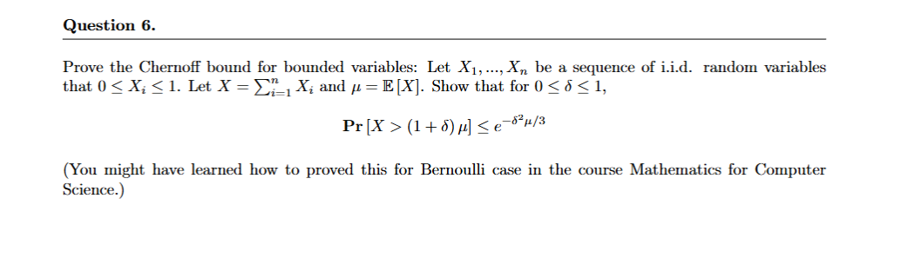

# ML-Problem-Set-1 

> **Question 1.**What are the differences between machine learning and artificial intelligence?

In machine learning, the key difference between Artificial Intelligence (AI) and Machine Learning (ML) lies in their scope and approach. AI is a broader concept, aiming to create machines that can perform tasks intelligently, while ML is a subset of AI focused on systems that improve through experience without explicit programming. AI may incorporate rule-based systems, expert systems, and other methods not necessarily reliant on learning, whereas ML specifically uses data and algorithms to train models to identify patterns and make decisions. AI’s goal is to simulate human intelligence and behavior, while ML focuses on improving performance through learning from data. Examples of AI include virtual assistants and autonomous vehicles, while ML examples include image recognition and spam detection. Historically, AI has existed since the 1950s, while ML gained prominence more recently due to advances in data and computing power. AI can operate with predefined rules, while ML requires large datasets and adapts through exposure to more data.

> **Question 2.**Explain the concepts: supervised learning, semi-supervised learning, unsupervised learning, self-supervised learning.

Supervised learning involves training models with labeled data, where the algorithm learns to map inputs to known outputs, such as in classification or regression tasks. Unsupervised learning, in contrast, uses unlabeled data to find patterns or structures on its own, such as clustering or anomaly detection. Semi-supervised learning uses a combination of labeled and unlabeled data, typically with a small amount of labeled data and a larger amount of unlabeled data. This is useful in real-world scenarios where labeling data is expensive. Self-supervised learning generates its own labels from the data, learning from the data’s inherent structure, and is used in tasks like predicting masked words in text or colorizing black-and-white images.

| Learning Type   | Labels                | Data Requirements                 | Common Applications                         |
| --------------- | --------------------- | --------------------------------- | ------------------------------------------- |
| Supervised      | Full labels           | Smaller datasets, but all labeled | Classification, Regression                  |
| Unsupervised    | No labels             | Large datasets                    | Clustering, Dimensionality Reduction        |
| Semi-Supervised | Partial labels        | Large datasets, few labels        | Real-world applications with limited labels |
| Self-Supervised | Auto-generated labels | Large datasets                    | Pre-training large models                   |

>**Question 3.**Read https://arxiv.org/abs/1803.07728, explain it using your own words.

In the paper "Unsupervised Representation Learning by Predicting Image Rotations" (2018), the authors introduce a self-supervised learning approach where a model predicts the rotation of an image (0°, 90°, 180°, or 270°). This task encourages the model to understand shapes, recognize patterns, and grasp spatial relationships, which are transferable to other tasks. The model uses a convolutional neural network (CNN) backbone, and the final layer is modified for four-way classification. The method has been shown to outperform random initialization and sometimes approaches the performance of supervised pre-training. This simple and efficient approach works well with limited data and has applications in transfer learning, few-shot learning, and visual understanding tasks.
```python
import torch
import torchvision.transforms as transforms

class RotationNet(nn.Module):
    def __init__(self):
        super().__init__()
        # Base CNN encoder
        self.features = torchvision.models.resnet18(pretrained=False)
        # Modify final layer for 4-way classification
        self.features.fc = nn.Linear(512, 4)
    
    def forward(self, x):
        return self.features(x)

def rotate_image(image, angle):
    # Rotate image by 0, 90, 180, or 270 degrees
    return transforms.functional.rotate(image, angle)

# Training loop
for image in dataset:
    rotations = [0, 90, 180, 270]
    for angle in rotations:
        rotated = rotate_image(image, angle)
        label = rotations.index(angle)
        pred = model(rotated)
        loss = criterion(pred, label)
```

> **Question 4.**If deep learning fails, give three possible reasons.

When deep learning models fail, three common reasons are data issues, model architecture or training problems, and optimization challenges. Data issues can include insufficient data, poor data quality, or mismatches between training and real-world data distributions. Model problems include underfitting (when the model is too simple) or overfitting (when the model memorizes the training data). Optimization problems involve challenges like vanishing gradients or poor initialization, leading to poor convergence or local minima. Ensuring adequate and high-quality data, selecting the right model architecture, and addressing optimization issues are crucial for successful deep learning applications.

> **Question 5.**Compare neural network with graphical model. What are the advantages of graphical model?

Neural Networks (NNs) and Graphical Models (GMs) differ in structure, learning approach, and interpretability. Neural Networks are characterized by a layered architecture with directed connections, typically in a feedforward manner, and rely on gradient-based optimization for learning. In contrast, Graphical Models represent explicit probability relationships between variables, which can be either directed (Bayesian) or undirected (Markov), and learn through probability estimation and inference. While Neural Networks are often seen as "black boxes" due to their lack of transparency, Graphical Models provide an explicit representation of dependencies and relationships, offering greater interpretability.

Graphical Models offer several advantages, including better interpretability, as they provide a clear visualization of variable relationships and dependencies, making it easy to understand causal relationships. They are also well-suited for handling uncertainty, as they incorporate probabilistic inference to manage multiple possible outcomes and missing data more effectively. Additionally, GMs can integrate domain knowledge directly into their structure, allowing for easier inclusion of prior expertise and constraints. Another benefit is sample efficiency; GMs are more capable of learning from smaller datasets and generalizing well even with limited data, making them robust to data sparsity. They also offer flexibility in inference, supporting various types of queries, including bidirectional inference and answering "what-if" questions.

Graphical Models excel in specific applications such as medical diagnosis, risk assessment, natural language processing, and computer vision. For example, in medical diagnosis, they can represent relationships between symptoms and diseases and provide probabilistic diagnoses, while in risk assessment, they can model dependencies between risk factors and support decision-making. GMs are also widely used in Hidden Markov Models for sequence modeling, Conditional Random Fields for labeling in NLP, and in image segmentation and multi-object tracking in computer vision.

However, Graphical Models have limitations, such as scalability issues with large numbers of variables and computational complexity, as exact inference can be NP-hard. They also do not automatically learn features like neural networks, often requiring manual feature engineering, and may struggle with complex, non-linear relationships or high-level abstractions. Despite these challenges, modern approaches combine the strengths of both Neural Networks and Graphical Models, including Deep Belief Networks, Neural Graphical Models, and Probabilistic Neural Networks, to leverage their respective advantages in handling various types of data and tasks. The choice between NNs and GMs largely depends on the problem structure, data availability, interpretability needs, and the role of uncertainty in the task.



**Solution：**
$$
\text{From Chebshev's law}: 
\forall t > 0 \qquad
\text{Pr}\{X > (1 + \delta )\mu\} = \text{Pr}\{e^{tX } >e^{(1 + \delta )\mu}\}
 \leq \frac{E(e^{tX})}{e^{(1 + \delta )\mu}}
$$


**Lemma 1**:

We claim that, for $0 \leq X_i \leq 1$
$$
e^{t X_i} \leq 1 + X_i(e^t - 1)
$$
Let $f(x)= - e^{tx} +1 + x(e^t - 1), \qquad t >0, \quad x \in [0,1]$
$$
f'(x)  = e^t- te^{tx}\\
f''(x) = -t^2e^{tx} < 0 \\
f(x) \text{在[0,1]上是上凸的函数}\\
\because f(0) = f(1) = 0\\
\therefore f(x) \geq 0, \qquad \forall x \in [0,1]
$$
Use Lemma 1
$$
e^{tX} = \prod_i e^{tX_i}, \qquad E(e^{tX} ) = (Ee^{tX_i})^n \leq [1 + EX_i (e^t - 1)]^n = [1 + \frac{\mu}{n}(e^t -1 )]^n\\
$$
**Lemma 2**:
$$
e^x \geq 1 + x
$$
Let $x= 1 + \frac{\mu}{n}(e^t -1 )$
$$
1 + \frac{\mu}{n}(e^t - 1) \leq e^{\frac{\mu}{n}(e^t - 1)}\\
E(tX) \leq e^{\mu(e^t - 1)}\\
 \text{Pr}\{X > (1 + \delta )\mu\}\leq e^{\mu(e^t - 1) - (1 + \delta)\mu t} = e^{\mu f(t)}
$$

$$
f(t) = (e^t - 1) - (1 + \delta) t \leq f(t_0) = f(\ln(1 + \delta)) = \delta - (1 + \delta)\ln(1 + \delta)
$$

**Lemma 3：**

Let $g(\delta) = \delta - (1 + \delta)\ln(1 + \delta) + \frac{1}{3} \delta^2$, we claim for $\delta \in [0, 1]$, $f(\delta) \leq 0$
$$
g'(\delta) = \frac{2}{3}\delta -\ln (1 + \delta)\\
g''(\delta) = \frac{2}{3} - \frac{1}{1 + \delta} \in [-\frac{1}{3},  \frac{1}{2}]\\
g'(0) = 0, g'(1) = \frac{2}{3} - \ln 2 < 0\\
\because g''(\delta) \text{先减后增}\\
\therefore g'(\delta) < 0, \qquad \forall \delta \in [0, 1]\\
\therefore g(\delta) \leq g(0) = 0\\
$$
Use Lemma 3: 
$$
\text{Pr}\{X > (1 + \delta )\mu\} \leq e^{\mu f(t)} \leq e^{\mu f(t_0)} = e^{\mu (g(\delta) - \frac{1}{3} \delta^2)} \leq e^{-\frac{1}{3}\delta^2 \mu}
$$
**Reference：**

- Machine learning 2021 Homework 1
  Yuan Yang (yuanyang@tsinghua.edu.cn)
  September 16, 2021