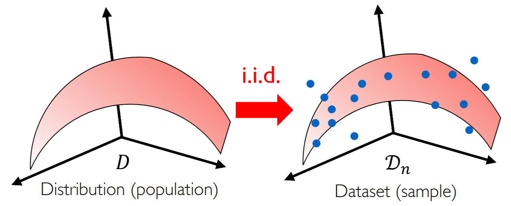
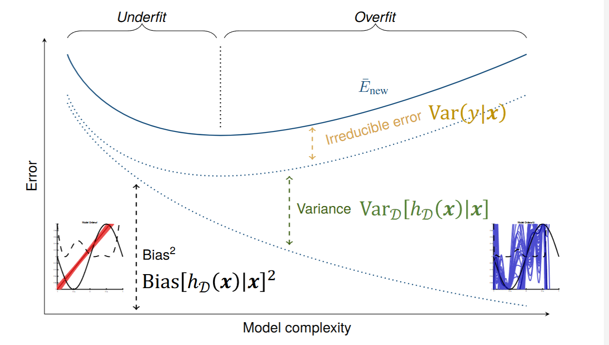
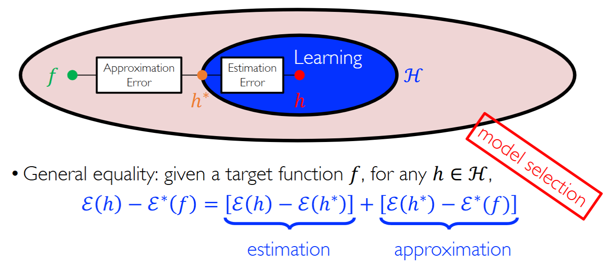
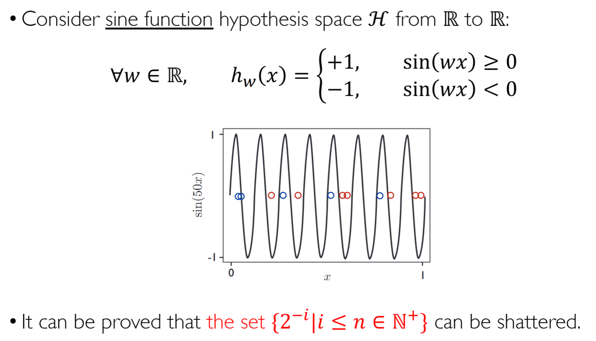

# Learning Theory

> 作者：Alex
>
> 联系方式：`wang-zx23@mails.tsinghua.edu.cn`

[TOC]

## 0 简介

离散数学是计算机科学的数学基础，概率和统计是现代主流机器学习的数学基础。本笔记旨在从基本的概率论不等式出发，简要梳理学习理论的脉络。

- 机器学习的基本假设：

>训练样本、测试样本均是从某一未知分布$(x,y) \sim D_{X \times Y} $中随机采样得到的，满足独立同分布假设。
>
机器**学习（learning）**并非是对数据的**拟合（fitting）**,我们希望模型具有**OOD（out of distribution）**泛化性。我们将模型在dataset上的表现用**损失函数（loss function)**来度量。

> *Definition 1*
>
> 期望误差（Expected error）：$\large{\varepsilon (h) = \mathbb{E}_{(x,y)\sim D(x,y)}\ell (h(x), y)}$
>
> 经验误差（Empirical error）：$\large{\hat \varepsilon_{\mathcal{D_n}} (h) = \frac{1}{n}\sum_{i=1}^n\ell(h(x_i),y_i)}$

我们的目标是找到一族参数，使得假设在分布上的期望误差达到最小，即$ h^* = \arg \mathop{\min}\varepsilon(h)$；期望误差相当于对分布$ D$ 上的所有样本（无穷个）对应的损失函数值求期望。倘若我们能够使得期望误差达到最小，就意味着我们找到了一个对于整个分布 D 都行之有效的假设函数 $h(x)$。然而，期望误差无法计算，实际工作中都是计算经验误差，对采样到的有限条样本计算损失函数值，更多的做法考虑到有限的算力，都只在一个batch上计算。实际上，经验误差是对期望误差的**无偏估计（unbiased estimator）**,即$\varepsilon(h) = E_{D_n \sim D^n} \hat \varepsilon_{\mathcal{D_n}} (h)$，我们有理由相信它能够较好地反映出期望误差。实际上，这就是学习理论讨论的核心问题。

---

## 1 偏差-方差分解

- 贝叶斯决策准则

若我们知道样本是从哪个分布中采样得到的，就可以依据该分布，计算出样本对应的条件概率，并取其中的最大值作为样本的标签，即$h_{Bayes}(x) = \arg\max_{y} P(y \mid x)$。

- 回归问题的二范数损失函数

对于给定输入 $x$，我们利用 $h_{\mathcal{D_n}}(x)$ 计算它所对应的输出 $y$。$h_{\mathcal{D_n}}$ 表示在数据集 $\mathcal{D_n}$ 上训练得到的模型， $\mathcal{D_n}$ 本身则是从分布 $D$ 中随机采样得到的。对于不同的 $\mathcal{D_n}$，我们采样得到的数据集是不一样的。因此，$h_{\mathcal{D_n}}(x)$ 是一个随机变量，可以对其求期望与方差。进一步，定义 $Regression \quad function:$  $f^{*}(x) = \mathbb{E}_y[y|x]$，表示在已知样本的生成分布 $D$ 时，对于给定的数据 $x$，输出值 $y$ 的期望，这也是所有的回归任务希望逼近的目标（上标 $*$ 代表最优）

对于回归问题，我们可以采用 $L2$ 作为损失函数
$$
(*) = \mathbb{E}_{D_n, y} \big [ \big(h_{D_n}(x) - y  \big)^2 | x\big ] = 
\mathbb{E}_{D_n, y} \big [ \big(h_{D_n}(x) - f^*(x) +  f^*(x) - y  \big)^2 | x\big ] \quad 
\\
= \mathbb{E}_{D_n, y}\big [\big(h_{D_n}(x) - f^*(x)\big)^2 + \big(f^*(x) -y\big)^2 + 2\big(h_{D_n}(x) - f^*(x)\big)\big(f^*(x) -y\big) |x \big ] \quad 
\\
= \mathbb{E}_{D_n} \big [\big(h_{D_n}(x) - f^*(x)\big)^2 |x\big] + 
\mathbb{E}_{y}\big[(f^*(x) -y\big)^2|x  \big ] +
2\mathbb{E}_{D_n, y}\big[\big(h_{D_n}(x) - f^*(x)\big)\big(f^*(x) -y\big)|x\big ] \quad
$$

$$
2\mathbb{E}_{D_n, y}\big[\big(h_{D_n}(x) - f^*(x)\big)\big(f^*(x) - y\big)|x\big ] = 
2\mathbb{E}_{D_n}\big[h_{D_n}(x) - f^*(x)|x\big ]\mathbb{E}_{y}\big[f^*(x) - y|x\big ]
\\
\because  Regression \quad function: f^{*}(x) = \mathbb{E}_y[y|x]
\\
\therefore \mathbb{E}_{y}\big[f^*(x) - y|x\big ] = \mathbb{E}_{y}\big[f^*(x)|x\big ] - \mathbb{E}_{y}\big[y|x\big ] = 0\quad 
\\
(*) = \mathbb{E}_{D_n} \big [\big(h_{D_n}(x) - f^*(x)\big)^2 |x\big] + 
\mathbb{E}_{y}\big[(f^*(x) -y\big)^2|x  \big ]
$$

  其中，$\mathbb{E}_{ y}\big[(f^*(x) -y\big)^2|x  \big ]$ 是贝叶斯错误率的来源，即 $y$ 中存在噪音。根据方差及 $f^*(x)$ 的定义 ，该式也可写作 $Var(y|x)$

  继续考察第一项 $\mathbb{E}_{D_n} \big [\big(h_{D_n}(x) - f^*(x)\big)^2 |x\big]$，我们采用相同的方法对其进行处理


$$
\mathbb{E}_{D_n} \big [\big(h_{D_n}(x) - f^*(x)\big)^2 |x\big]
\\
= \mathbb{E}_{D_n} \big [\big(h_{D_n}(x) - {E}_{D_n} \big [ h_{D_n}(x)\big ] + {E}_{D_n} \big [h_{D_n}(x) \big ]- f^*(x)  \big)^2|x\big]
\\
= \mathbb{E}_{D_n} \big [\big(h_{D_n}(x) - {E}_{D_n} \big [ h_{D_n}(x)\big ]\big)^2|x\big ] + 
\mathbb{E}_{D_n} \big [\big( {E}_{D_n} \big [h_{D_n}(x) \big ]- f^*(x)  \big)^2|x\big ] 
\\
+2\mathbb{E}_{D_n} \big [h_{D_n}(x) - {E}_{D_n} \big [ h_{D_n}(x)\big ]|x\big ] 
\cdot
\mathbb{E}_{D_n} \big [ {E}_{D_n} \big [h_{D_n}(x) \big ]- f^*(x)  |x\big ]
\quad (5)
$$

$$
\mathbb{E}_{D_n} \big [h_{D_n}(x) - {E}_{D_n} \big [ h_{D_n}(x)\big ]|x\big ] =
\mathbb{E}_{D_n} \big [h_{D_n}(x)|x \big]-\mathbb{E}_{D_n} \big [h_{D_n}(x)|x \big] = 0
\\
(5) = \mathbb{E}_{D_n} \big [\big(h_{D_n}(x) - {E}_{D_n} \big [ h_{D_n}(x)\big ]\big)^2|x\big ] + 
\mathbb{E}_{D_n} \big [\big( {E}_{D_n} \big [h_{D_n}(x) \big ]- f^*(x)  \big)^2|x\big ]
$$

  其中，$\mathbb{E}_{D_n} \big [\big(h_{D_n}(x) - {E}_{D_n} \big [ h_{D_n}(x)\big ]\big)^2|x\big ]$ 形式上就是方差的定义式，记作 $Var_{D}[h_{D}(x)|x]$ （由于是对所有的 $D_n$ 求期望，因此得到的就是 $D$）该式可以反映模型对分布 $D$ 上的不同数据集的鲁棒性质。 $\mathbb{E}_{D_n} \big [\big( {E}_{D_n} \big [h_{D_n}(x) \big ]- f^*(x)  \big)^2|x\big ]$ 则是偏差平方，即从训练集学习到的 $h_{D_n}$ 与真值函数 $f^*$ 之间的差距。

回归问题的期望误差由三部分组成：
$$
\large \varepsilon_{L2}(x) = Var(y|x) + Bias\big[h_D(x)|x  \big]^2 + Var_{D}\big[h_D(x)|x\big]
$$



反映在实际操作中一般表现为简单模型偏差大、方差小；复杂模型偏差小、方差大。



用这张图片我们可以很好地看出目标函数、假设空间、估计误差、近似误差这些概念之间的关系。我们如下介绍的学习理论实际上都是希望对于对于估计误差$\varepsilon(h) - \varepsilon^{*}(h)$给出了一个界。

---

## 2 常用不等式

### 2.1 Tail Estimation

#### Markov's Inequality
$$
\text{Pr}\{X \geq \varepsilon\} \leq \frac{\mathbb{E}[X]}{\varepsilon}
$$
>proof:
$$
\mathbb{E}[X] = \int_0^\infty \text{Pr}\{X \geq t\} dt \geq \int_\varepsilon^\infty \text{Pr}\{X \geq t\} dt \geq \varepsilon \text{Pr}\{X \geq \varepsilon\}
$$

#### Chebyshev's Inequality
>Chebyshev's Lemma:

$$
\Phi(x) \text{ is a non-decreasing, non-negative function}\\
\text{Pr}\{X \geq \varepsilon\} = \text{Pr}\{\Phi(X) \geq  \Phi(\varepsilon)\} \leq \frac{\mathbb{E}[\Phi(X)]}{\Phi(\varepsilon)}
$$


$$
\text{Pr}\{|X - \mu| \geq \varepsilon\} \leq \frac{\sigma^2}{\varepsilon^2}
$$
>proof:
$$
\text{version 1(by Markov's inequality):}\\
\text{Pr}\{|X - \mu| \geq \varepsilon\} = \text{Pr}\{(X - \mu)^2 \geq \varepsilon^2\} \leq \frac{\mathbb{E}[(X - \mu)^2]}{\varepsilon^2} = \frac{\sigma^2}{\varepsilon^2}\\

\text{version 2(by Lemma):}\\
\text{Pr}\{|X - \mu| \geq \varepsilon\} = \text{Pr}\{\Phi(|X - \mu|) \geq \Phi(\varepsilon)\} \leq \frac{\mathbb{E}[\Phi(|X - \mu|)]}{\Phi(\varepsilon)}\\
\Phi(t) = t^2 \text{ is a non-decreasing, non-negative function}\\
\mathbb{E}[\Phi(|X - \mu|)] = \mathbb{E}[(X - \mu)^2] = \sigma^2\\
\text{Pr}\{|X - \mu| \geq \varepsilon\} \leq \frac{\sigma^2}{\varepsilon^2}
$$
#### Chernoff Bounds (version 1)
$$
\text{Pr}\{\Sigma_i(X_i - E[X_i]) \geq \varepsilon\} \leq \frac{\prod_i E(e^{\lambda (X_i - E[X_i])})}{e^{\lambda \varepsilon}}
$$
>proof:
$$
\text{by Chebyshev's Lemma, let } \Phi(t) = e^{\lambda t}, \text{then } \text{Pr}\{\Sigma_i(X_i - E[X_i]) \geq \varepsilon\} \leq \frac{E(e^{\lambda \Sigma_i(X_i - E[X_i])})}{e^{\lambda \varepsilon}} = \frac{E(\prod_i  e^{\lambda (X_i - E[X_i])})}{e^{\lambda \varepsilon}}  = \frac{\prod_i E(e^{\lambda (X_i - E[X_i])})}{e^{\lambda \varepsilon}} \\
$$

#### Chernoff Bounds (version 2)
$X = \Sigma_i X_i, X_i \in \{0,1\}, \text{Pr}\{X_i = 1\} = p_i, X_i \text{ are i.i.d.}$,Let $\mu = \mathbb{E}[X] = \Sigma_i p_i$. Then:
$$
 \text{upper bound}: \text{Pr}\{X \geq (1+\delta)\mu\} \leq (\frac{e^{\delta }}{(1+\delta)^{1 + \delta}})^{\mu }, \forall \delta > 0\\
 \text{lower bound}: \text{Pr}\{X \leq (1-\delta)\mu\} \leq (\frac{e^{-\delta}}{(1-\delta)^{1 - \delta}})^{\mu }, \forall 0 \leq \delta <1\\
$$
>proof:
$$
\text{Pr}\{X \geq (1+\delta)\mu\} = \text{Pr}\{e^{t X} \geq \exp(t (1+\delta)\mu)\} \leq \frac{\mathbb{E}[e^{t X}]}{e^{t(1+\delta)\mu}} \\
E(e^{tX}) = \prod_i E(e^{tX_i}) = \prod_i (1-p_i + p_ie^{t}) = \prod_i (1-p_i + p_i e^t) \\
\text{In consider of }e^{t} \geq t + 1,\text{let  } t = e^{p_i(e^t - 1)}\\
\prod_i (1-p_i + p_i e^t)  = \prod_i(1 + p_i(e^t - 1)) \leq \prod_i e^{p_i(e^t - 1)} = e^{\mu(e^t - 1)} = e^{f(t)} \\
f(t) = \mu(e^t - 1) - t(1 + \delta)\mu \\
 t_0 = \ln(1+t), f(t) \leq f(t_0) \\
\text{Pr}\{X \geq (1+\delta)\mu\} \leq e^{f(t_0)} = (\frac{e^{\delta }}{(1+\delta)^{1 + \delta}})^{\mu }, \forall \delta > 0\\z
$$

#### Hoeffding's Inequality
>Hoeffding's Lemma:
$$
\text{V is a random bounded variable, }  E[V] = 0, a \leq V \leq b, b > a\\
E(e^{\lambda V}) \leq e^{\frac{\lambda^2}{8}(b-a)^2}
$$
>proof:
$$
\Phi(\lambda) = \ln[\frac{b e^{\lambda a} }{b- a} + \frac{-a e^{\lambda b}}{b-a}]\\
\Phi'(\lambda) = a - \frac{a}{(b-a)(b e^{-\lambda(b-a)} - a)} \\
\Phi(0) = \Phi'(0) = 0, \Phi''(\lambda) \leq 1\\
\Phi(\lambda)  = \Phi(0) + \lambda \Phi'(0) + \frac{\lambda^2}{2}\Phi''(\theta) \leq e^{\frac{\lambda^2}{8}(b-a)^2}\\
V \rightarrow e^{\lambda V} \text{ is a convex function}\\
e^{\lambda V} \leq \frac{b - V}{b - a} e^{\lambda a} + \frac{V - a}{b - a} e^{\lambda b} \\
E(e^{\lambda V}) \leq E(\frac{b - V}{b - a} e^{\lambda a} + \frac{V - a}{b - a} e^{\lambda b}) = \Phi(\lambda) \leq e^{\frac{\lambda^2}{8}(b-a)^2}\\
$$

>Hoeffding's Inequality:

$$
\text{For } a_i \leq X_i \leq b_i, \text{Pr}\{|\Sigma_i^n(X_i - EX_i) | \geq \varepsilon \} \leq 2 e^{-\frac{2 \varepsilon^2}{\Sigma_i^n (b_i - a_i)^2}}\\
$$
>proof:
$$
\text{From Hoeffding's Lemma: }E(e^{\lambda V}) \leq e^{\frac{\lambda^2}{8}(b-a)^2}\\
\text{For n r.v. }X_i, \quad a_i \leq X_i \leq b_i, \quad \text{Let } V = \Sigma_i^n (X_i - EX_i)\\
\frac{\prod_{i=1}^n \mathbb{E}[e^{\lambda (X_i - EX_i)}]}{e^{\lambda \varepsilon}} \leq e^{\frac{\lambda^2}{8} \Sigma_i^n (b_i - a_i)^2 - \lambda \varepsilon}\\
\text{Let } g(\lambda) = \frac{\lambda^2}{8} \Sigma_i^n (b_i - a_i)^2 - \lambda \varepsilon\\
g(\lambda) \leq g(\lambda_0) = g(\frac{4\varepsilon}{\Sigma_i^n (b_i - a_i)^2}) = \frac{\varepsilon^2}{\Sigma_i^n (b_i - a_i)^2}\\
\text{Thus, }\text{Pr}\{\Sigma_i^n(X_i - EX_i)  \geq \varepsilon \} \leq e^{-2\frac{ \varepsilon^2}{\Sigma_i^n (b_i - a_i)^2}}\\
\text{Thus, }\text{Pr}\{\Sigma_i^n(X_i - EX_i)  \geq -\varepsilon \} \leq e^{-2\frac{ \varepsilon^2}{\Sigma_i^n (b_i - a_i)^2}}\\
\text{For } a_i \leq X_i \leq b_i, \text{Pr}\{|\Sigma_i^n(X_i - EX_i) | \geq \varepsilon \} \leq 2 e^{-\frac{2 \varepsilon^2}{\Sigma_i^n (b_i - a_i)^2}}\\
$$
#### McDiarmid's Inequality
$$
X_1, X_2, \cdots , X_n \text{ are i.i.d. random variables, } f: \mathbb{R}^n \rightarrow \mathbb{R} \text{ is a stable function, }\\
\sup_{X_1, \cdots, X_i' , X_n} |f(X_1, X_2, \cdots , X_n) - f(X_1, \cdots, X_i' , \cdots, X_n)| \leq c_i, \forall i \in \{1,2, \cdots , n\}\\
\text{Theorem: } \text{Pr}\{ |f(X_1, X_2, \cdots , X_n) - \mathbb{E}[f(X_1, X_2, \cdots , X_n)]| \geq \varepsilon\} \leq 2e^{-\frac{2\varepsilon^2}{\sum_{i=1}^n c_i^2}}
$$
>proof:
$$
\text{Use Hoeffding's Inequality, let  }\{c_i = b_i - a_i\}\\
$$
#### Mill's Inequality
$$
Z \sim \mathcal{N}(0, 1), \quad \text{Pr}\{P(|Z| \geq t)\} \leq \sqrt{\frac{2}{\pi}}e^{-\frac{t^2}{2}} / t
$$
>proof:
$$
\text{P}(|Z| \geq t)  = 2\text{P}(Z^2 \geq t^2) = \sqrt{\frac{2}{\pi}}\int_t^\infty e^{-\frac{x^2}{2}}dx \\
I = \int_t^\infty e^{-\frac{x^2}{2}}dx = \int_t^\infty\frac{1}{x} (x e^{-\frac{x^2}{2}})dx = \frac{e^{-\frac{t^2}{2}}}{t} - \int_t^\infty\frac{1}{x^2} (e^{-\frac{x^2}{2}})dx\\
\text{Thus }  \text{Pr}\{P(|Z| \geq t)\} \leq \sqrt{\frac{2}{\pi}}e^{-\frac{t^2}{2}} / t
$$
#### Bernoulli's Inequality
$$
Let X_1, X_2, \cdots, X_n \text{ be Bernoulli random variables, }X_i \sim \mathcal{Bernoulli}(p)\\
\forall \varepsilon > 0, \text{Pr}\{ | \frac{1}{n}\sum_{i=1}^n X_i - p| \geq \varepsilon\} \leq 2e^{-2 n \varepsilon^2}
$$
· more about tail bound theory:

```
https://people.sc.fsu.edu/~jburkardt/classes/mlds_2019/III-Tail-Bounds.pdf
```

### 2.2 Other Inequalities

#### Jensen's Inequality
对凸函数$f$（def：$\forall \lambda \in [0,1]$，有$f$lambda x + (1-\lambda)y) \leq \lambda f(x) + (1-\lambda)f(y)$
$$
f(\mathbb{E}[X]) \leq \mathbb{E}[f(X)]
$$
#### Union bound
$$
\text{Pr}\{A \cup B\} \leq \text{Pr}\{A\} + \text{Pr}\{B\}\\
\text{Pr}\{A \cap  B\} = 1 - \text{Pr}\{\neg (A \cap B)\} = 1 - \text{Pr}\{ A^c \cup B^c\} \geq 1 - \text{Pr}\{A^c\} - \text{Pr}\{B^c\} 
$$

#### Inversion rule
Let $\delta = f$varepsilon)$
$$
\text{Pr}\{X\geq \varepsilon \} \leq f(\varepsilon) \iff \text{Pr}\{X \leq f^{-1}(\delta)\} \geq 1-\delta
$$

#### Cauchy-Schwarz Inequality
$$
\mathbb{E}[XY] \leq \sqrt{\mathbb{E}[X^2]\mathbb{E}[Y^2]}
$$

### 3 PAC可学习

- PAC是概率近似正确学习(Probabilistic Approximate Correct Learning)的缩写。
>Definition:

A hypothesis space $\mathcal{H}$ is **PAC-learnable** if there exists an algorithm $\mathcal{A}$ and a polynomial function $\text{poly}()$, such that for any $\varepsilon > 0$, $\delta > 0$, for all distributions $D$ on $\mathcal{X}$ and for any target hypothesis $h \in \mathcal{H}$, the following holds for sample complexity $n \geq \text{poly}(\frac{1}{\varepsilon}, \frac{1}{\delta}, |\mathcal{H}|)$:

$$P_{\mathcal{D}_n \sim D^n}[\mathcal{E}(h_{\mathcal{D}_n}) - \min_{h \in \mathcal{H}} \mathcal{E}(h) \geq \varepsilon] \leq \delta$$

Where:
- $h^* = \text{argmin}_{h \in \mathcal{H}} \mathcal{E}(h)$
- "Approximately correct" refers to the error bound $\varepsilon$
- "Probably correct" refers to the confidence bound $\delta$

对PAC可学习的通俗理解:对于一个较好的假设空间，总能以较大的概率保证期望误差与经验误差只相差一个小量。PAC学习理论为机器学习提供了重要的理论基础。有了前面的不等式基础，我们将导出有限假设空间的泛化误差界，并--证明有限假设空间是PAC可学习的.

## 4 有限假设空间泛化误差界

### 4.1 单一假设空间

我们用已经导出的**Hoeffding's Inequality**来推导单一假设下的泛化误差上界。
$$
P\bigg(\bigg|\sum_{i=1}^n \big(X_i - \mathbb EX_i \big) \bigg| \geq \epsilon \bigg) \leq 2 \exp \bigg[ - \frac{2\epsilon^2}{\sum_{i=1}^n (b_i - a_i)^2} \bigg]
$$
令$X_i = \ell (h(x_i), y_i$,我们看出
$$
\sum_{i=1}^n \big(X_i - \mathbb EX_i \big)  
= n\bigg\{\bigg[\frac{1}{n}\sum_{i=1}^n \ell(h(x_i), y_i)  \bigg]- \mathbb E_{(x,y)\sim D}\ell(h(x), y) \bigg\}
= n\big(\hat{\varepsilon}_{D_n}(h) - \varepsilon (h) \big)
$$
由$X_i = \ell (h(x_i), y_i \in [0,1] = [a_i, b_i]$,可以得到 $\text{Pr}\{|\big(\hat{\varepsilon}_{D_n}(h) - \varepsilon (h) \big)| \geq \varepsilon\} \leq 2e^{-2n\varepsilon^2}$

希望 $\big| \hat{\varepsilon}_{D_n}(h) - \varepsilon (h)\big| \geq \epsilon$ 是一个小概率事件，如此就能保证我们在一个有限的数据集上训练得到的模型，其经验误差偏离期望误差较大的情况，发生可能性很小。通俗的理解是能在采样得到的数据集上训练出靠谱的模型）
$$
\text{Let}\quad \delta = P\big(\big| \hat{\varepsilon}_{D_n}(h) - \varepsilon (h)\big| \geq \epsilon \big)

\\

\text{Then}\quad \delta  \leq 2 e^{-2n\epsilon^2} \Rightarrow  \epsilon \leq \frac{\log \frac{2}{\delta}}{2n}
$$
 实际上j就是应用Inversion rule,我们可以得到$\varepsilon (h) \leq  \hat{\varepsilon}_{D_n}(h) + \frac{\log \frac{2}{\delta}}{2n}$至少以 $1 - \delta$ 的概率发生。这也是所谓可能正确学习理论的含义。上述推导中，我们假设 $h$ 是固定的，即设假设空间中只有一个假设，但在实际场景中，$h$ 实则是一个随机变量，我们一般取 $h$ 为
$$
\mathcal{D_n} \rightarrow h_{\mathcal{D_n}} = \arg \min_{h \in \mathcal{H} } \hat{\varepsilon}_{\mathcal{D_n}}(h)
$$
 即在函数族 $\mathcal{H}$ 中，选择于 $\mathcal{D_n}$ 上经验误差最小的 $h$。这时候需要采用保守学习的思想，考虑最坏的情形，来获得松弛的上界。

### 4.2 多假设的有限假设空间

$$
P\big(\exists h \in \mathcal{H}, \big| \hat{\varepsilon}_{D_n}(h) - \varepsilon(h) \big | \geq \epsilon\big)  = P\big(\sup_{h\in \mathcal{H}} \big|  \hat\varepsilon_{D_n}(h) - \varepsilon(h) \big | \geq \epsilon \big|\big)\quad (1)
\\
= P\big(\big[\big| \hat{\varepsilon}_{D_n}(h_1) - \varepsilon(h_1) \big| \geq \epsilon \big]  \vee ... \vee \big[\big| \hat{\varepsilon}_{D_n}(h_{\mathcal{|H|}}) - \varepsilon(h_{\mathcal{|H|}})\big| \geq \epsilon \big]\big) \quad (2)
\\
\leq \sum_{h \in \mathcal{H}} P\big(\big| \hat{\varepsilon}_{D_n}(h) - \varepsilon(h) \big | \geq \epsilon \big) \leq 2\mathcal{|H|} \exp(-2n\epsilon^2) \quad (3)
$$

使用**Union bound**，得到
$$
\text{Let}\quad \delta = \sum_{h \in \mathcal{H}} P\big(\big| \hat{\varepsilon}_{D_n}(h) - \varepsilon(h) \big | \geq \epsilon \big) 
\\
\text{Then}\quad \delta \leq 2\mathcal{|H|} \exp(-2n\epsilon^2)
\\
\epsilon \leq \sqrt{\frac{\log \mathcal{|H|} + \log(\frac{2}{\delta})}{2n}}
$$
总结一下，有限假设空间说了一件什么事呢：对于一个有限的假设空间$\mathcal{H} = \{\mathcal{h_1},\mathcal{h_2}, \cdots, \mathcal{h_n}\}$，则我们总是可以以$1- \delta$的概率保证，对于任何一个假设空间中的假设$\mathcal{h} \in \mathcal{H}$,期望误差被经验误差的一个上界控制住。形式化：

- _Let_ $\mathcal{H}$ _be a finite hypothesis space,_ $\mathcal{H} < \infty,$ _then for any_ $\delta > 0,$ _with probability at least_ $1 - \delta$

$$
\forall h \in \mathcal{H}， \varepsilon(h) \leq \hat\varepsilon_{D_n}(h) +
\sqrt{\frac{\log|\mathcal{H}| + \log \frac{2}{\delta}}{2n}}
$$

- **remark**：当样本数 $n$ 增多后，模型效果会变好：右侧第二项减小，经验误差与期望误差之间的差距减小）。模型容量的期望误差曲线是 _U_ 形：当假设空间 $\mathcal{H}$ 增大时，尽管模型的拟合能力更强，$\hat\varepsilon_{D_n}(h)$ 更小， $\sqrt{\frac{\log|\mathcal{H}| + \log \frac{2}{\delta}}{2n}}$ 却更大了，因此期望误差先减后增，此时发生的是过拟合。

这里填一个坑：为何期望误差与经验误差之间的差距的上界反映了模型的泛化能力：希望在自己有限的数据集上训练得到的模型，能够顺利得到应用，即便是面对它未曾接触过的输入，也可以给出正确合理的答案，这就是泛化。

对于神经网络构成的假设函数族，可以使用量化的trick：计算机是有编码位的，有限的存储空间能够表示的状态数也一定是有限的。

### 4.3 有限假设空间是PAC-可学习的

$$
\text{proof:}\\
\mathcal{E}(h_{\mathcal D_n}) - \mathcal{E}(h^*) = 
\mathcal{E}(h_{\mathcal D_n}) - \hat{\mathcal{E}}_{\mathcal D_n}(h_{\mathcal D_n}) + \hat{\mathcal{E}}_{\mathcal D_n}(h_{\mathcal D_n})- \mathcal{E}(h^*)\quad 
\\
\leq 
\mathcal{E}(h_{\mathcal D_n}) - \hat{\mathcal{E}}_{\mathcal D_n}(h_{\mathcal D_n}) + \hat{\mathcal{E}}_{\mathcal D_n}(h^*)- \mathcal{E}(h^*)\quad 
\\
\leq
\big|\mathcal{E}(h_{\mathcal D_n}) - \hat{\mathcal{E}}_{\mathcal D_n}(h_{\mathcal D_n}) \big| + \big|\hat{\mathcal{E}}_{\mathcal D_n}(h^*)- \mathcal{E}(h^*) \big|\quad 

\leq 2\sup_{h \in \mathcal{H}}\big|\hat{\mathcal{E}}_{\mathcal D_n}(h)- \mathcal{E}(h) \big|\quad
$$

$$
P(\mathcal{E}(h_{\mathcal D_n}) - \mathcal{E}(h^*)\geq \epsilon)
\leq P(\sup_{h \in \mathcal{H}}\big|\hat{\mathcal{E}}_{\mathcal D_n}(h)- \mathcal{E}(h) \big|\geq \frac{\epsilon}{2})
\\
= P(\exists h\in \mathcal{H},\big|\hat{\mathcal{E}}_{\mathcal D_n}(h)- \mathcal{E}(h) \big|\geq \frac{\epsilon}{2})
= 2|\mathcal{H}|\exp(\frac{-n\epsilon^2}{2}) = \delta
$$

## 5 无限假设空间泛化误差界

无限假设空间，指$|\mathcal{H}|\rightarrow +∞ $的情况，即假设空间中存在无数个假设。在日常生活中，我们使用的大部分机器学习模型，假设空间基本都是无穷的。如何度量一个无限的假设空间呢？接下来介绍的三种方法通过模型拟合数据的能力，间接刻画假设空间的复杂性。可以直观理解可以是模型拟合数据的能力越强，它所对应的假设空间就越复杂。

### 5.1 Rademacher Complexity

- 考虑一个给定的数据集 $S$，它共有 $n$ 个样本

$$
S=\big((x_1, y_1) ,(x_2, y_2)...(x_n, y_n) \big)\quad where\quad y_i = \{-1, +1\}
$$

  利用模型集 $h$ 对其进行划分,即
$$
h(x): S \rightarrow \{-1, +1\}
$$
使用01损失函数，则经验误差为:
$$
\frac{1}{n}\Sigma_{i = 1}^n \mathbf{1}[\mathcal{h}(x_i) \neq y_i] = \frac{1}{n}\Sigma_{i = 1}^n \frac{1 - y_ih(x_i)}{2}\\
= \frac{1}{2} - \frac{1}{2n}\sum_{i=1}^n y_ih(x_i)
$$
 因此可以定义预测结果和真实结果之间的相关性 $\text{correlation} = \frac{1}{n}\sum_{i=1}^n y_ih(x_i) \in [0, 1]$,这个值越大，则表明模型的分类效果越好，因此我们的目标就是找到
$$
h^{*} = \large \sup_{h \in \mathcal{H}} \frac{1}{n}\sum_{i=1}^n y_ih(x_i)
$$
为了导出*Rademacher*复杂度的表达形式，我们需要知道对分（**dichotomy**）和打散（**shatters**）的概念。对分可以理解为把样本集合中的每一个点都打上标签，n个点就有$2^n$个对分的方式，而一个假设空间可以把n个点打散则意味着，假设空间有足够多的假设来区分这$2^n$种对分的方式。那么，不难理解可以用下面的式子定义拉达马赫复杂度。
$$
\frac{1}{2n} \sum_y \sup \frac{1}{n} \sum_{i=1}^{n} y_i \mathcal{h}(\mathbf{x_i})
\text{或者写为}\mathbb{E}_y \large \sup_{\mathcal{h \in H}}\frac{1}{n} \sum_{i = 1}^n y_i \mathcal{h}(\mathbf{x_i})
$$
样本的标签$y_i$习惯于写成$\sigma_i$,是一个取值$\in \{1,-1\}$伯努利变量于是有：

- 经验**Rademacher**复杂度的定义

$$
\hat{R}_{\mathcal{S}_n}(g) = \mathbb{E}_{\sigma} \left[ \sup_{g \in G} \frac{1}{n} \sum_{i=1}^{n} \sigma_i g(\mathbf{z}_i) \right]
$$

- 期望**Rademacher**复杂度的定义
  $$
  \hat{R}_{\mathcal{S}_n}(\mathcal{G}) = \mathbb{E}_{\sigma \sim \{-1, 1\}^n} \left[ \sup_{g \in G} \frac{1}{n} \sum_{i=1}^{n} \sigma_i g(z_i) \right]
  $$

> Theorem: 期望**Rademacher**复杂度关于n是不增的函数

proof:

我们需要证明 $R_{n+1}(\mathcal{G}) = \mathbb{E}_{D_{n+1}} \left\{ \mathbb{E}_{\sigma} \left[ \sup_{g \in G} \frac{1}{n+1} \sum_{i=1}^{n+1} \sigma_i g(z_i) \right] \right\} \leq R_n(\mathcal{G})$.根据定义有：
$$
R_{n+1}(\mathcal{G}) = \mathbb{E}_{D_{n+1}} \left\{ \mathbb{E}_{\sigma} \left[ \sup_{g \in G} \frac{1}{n+1} \sum_{i=1}^{n+1} \sigma_i g(z_i) \right] \right\}
$$
 通过**重采样**技术（思想是本来采n个样本求期望，现在是采n*（n+1）个样本）
$$
= \frac{1}{n+1}E_{D^{n+1}}\{E_{\sigma}[\sup \sum_{k=1}^{n+1}(\frac{1}{n} \sum_{i \neq k} \sigma_i g(z_i))]\}
$$

3. 由于 $ \sup $ 满足$\sup (A+B) \leq \sup A + \sup B$ 的性质，我们可以得到：

$$
\leq \frac{1}{n+1}\sum_{k=1}^{n+1}\mathbb{E}_{D^{n+1}}\left\{\mathbb{E}_{\sigma}\left[\sup_{g\in\mathcal{G}}\frac{1}{n}\sum_{i\neq k}\sigma_ig(\mathbf{z}i)\right]\right\} = \mathcal{R}_n(\mathcal{G})
$$

- 基于 Rademacher复杂度的泛化误差界

> Theorem:

Let $\mathfrak{g}$ be a family of general functions mapping from $\mathrm {Z}$ to $[0, 1]$. Then, for any $\delta > 0$, with probability at least $1 - \delta$, the following bound holds for all $g \in \mathfrak{g}$
$$
\mathbb{E}_{z\sim D}\big[g(z) \big]\leq \frac{1}{n}\sum_{i=1}^n g(z_i) + 2\mathcal{R}_n(g) + \sqrt\frac{\log(1/\delta)}{2n}\\

\mathbb{E}_{z\sim D}\big[g(z) \big]\leq \frac{1}{n}\sum_{i=1}^n g(z_i) + 2\hat{\mathcal{R}}_n(g) + 3\sqrt\frac{\log(2\delta)}{2n}
$$


proof:
$$
Let\quad \Phi(\mathcal{S}) = \sup_{g \in \mathfrak{g}}(\mathbb{E}_D[g] - \hat{\mathbb{E}}_{\mathcal{S}}[g])\quad where\quad \mathcal{S}=(z_1,z_2,...,z_n)
$$


 回忆 $McDiarmid$ 不等式

 若 $x_1, x_2,...,x_m$ 为 $m$ 个独立随机变量，且对任意 $1 \leq i \leq m$，函数 $f$ 满足
$$
\large \sup_{x_1, ..., x_m, x'_i} |f(x_1, ...,x_m) - f(x_1,...,x_{i-1},x'_i,x_{i+1},...,x_m)| \leq c_i
$$
 则对任意 $\epsilon > 0$ 有
$$
P\big(f(x_1,...,x_m) - \mathbb E(f(x_1,...,x_m))\geq \epsilon \big) \leq \exp(\frac{-2\epsilon^2}{\sum_{i=1}c_i^2})

 \\

 P\big(\big| f(x_1,...,x_m) - \mathbb E(f(x_1,...,x_m)) \big |\geq \epsilon \big) \leq 2\exp(\frac{-2\epsilon^2}{\sum_{i=1}c_i^2})
$$


 可见，要应用 $McDiarmid$ 不等式，应先要满足其条件。于是引入 $\mathcal{S}'$， $\mathcal{S}'$ 与 $\mathcal{S}$ 只有一个变量的取值不同

 _Change_ $\mathcal{S}$ _to_ $\mathcal{S}'= \{z_1,...,z_i',..,z_n\}$ _that differs only at_ $z_i' \not = z_i$
$$
\Phi(\mathcal{S}) - \Phi(\mathcal{S}') = 

\sup_{g \in \mathfrak{g}}(\mathbb E_D[g] - \hat{\mathbb{E}}_{\mathcal{S}}[g]) -

\sup_{g \in \mathfrak{g}}(\mathbb E_D[g] - \hat{\mathbb{E}}_{\mathcal{S}'}[g])

\quad (1)

\\

\leq \sup_{g \in \mathfrak{g}}\{(\mathbb E_D[g] - \hat{\mathbb{E}}_{\mathcal{S}}[g]) - (\mathbb E_D[g] - \hat{\mathbb{E}}_{\mathcal{S}'}[g])\}\quad (2)

\\

= \sup_{g \in \mathfrak{g}}\{\hat{\mathbb{E}}_{\mathcal{S}'}[g] - \hat{\mathbb{E}}_{\mathcal{S}}[g]\}

= \sup_{g \in \mathfrak{g}} \{\frac{1}{n}\sum_{z\in \mathcal{S}'}g(z) - \frac{1}{n}\sum_{z\in \mathcal{S}}g(z)\}\quad (3)

\\

= \frac{1}{n}\sup_{g \in \mathfrak{g}}\{g(z_i') - g(z_i)\}\leq \frac{1}{n}\quad (4)
$$
 $(2)$ 式是在 $(1)$ 的基础上，通过 $\sup$ 的性质得到的，形式很类似于三角不等式。由于 $\mathcal{S}'$ 与 $\mathcal{S}$ 只有一个变量的取值不同（$z_i' \not = z_i$），且 $g(z_i) \leq 1$，所以 $(3) \rightarrow (4)$。至此，使用 $McDiarmid$ 不等式的条件已经满足，取 $c_i = \frac{1}{n}$
$$
P\Big(\Phi(\mathcal{S}) - \mathbb E_{\mathcal{S}}\Phi(\mathcal{S})\geq \epsilon \Big) 

\leq \exp\Big(- \frac{2\epsilon^2}{\sum_{i=1}^n \frac{1}{n^2}} \Big) = \exp(-2n\epsilon^2)
$$
 令 $\delta = P\Big(\Phi(\mathcal{S}) - \mathbb E_{\mathcal{S}}\Phi(\mathcal{S})\geq \epsilon \Big)$，则有 $\delta \leq \exp(-2n\epsilon^2)$，解出 $\epsilon$，

 则 _With probability at least_ $1 - \frac{\delta}{2}$：$\Phi(\mathcal{S}) \leq \mathbb E_{\mathcal{S}}[\Phi(\mathcal{S})] + \sqrt \frac{\log(2/\delta)}{2n}\quad (*)$

 在 $(*)$ 的基础上，我们进一步求 $E_{\mathcal{S}}[\Phi(\mathcal{S})]$ 的上界
$$
E_{\mathcal{S}}[\Phi(\mathcal{S})] = \mathbb E_{\mathcal{S}}\Big[\sup_{g \in \mathfrak{g}}\big(\mathbb E_D[g] - \hat{\mathbb{E}}_{\mathcal{S}}[g]  \big) \Big]

\\

= \mathbb E_{\mathcal{S}}\Big[\sup_{g \in \mathfrak{g}}\big(\mathbb E_{\mathcal{S}'} \hat{\mathbb E}_{\mathcal{S}'}[g] -  \hat{\mathbb{E}}_{\mathcal{S}}[g]\big)\Big] \quad (2)

\\

= \mathbb E_{\mathcal{S}}\Big[\sup_{g \in \mathfrak{g}}\mathbb E_{\mathcal{S}'}\big( \hat{\mathbb E}_{\mathcal{S}'}[g] -  \hat{\mathbb{E}}_{\mathcal{S}}[g]\big)\Big]\quad (3)

\\

\leq \mathbb E_{\mathcal{S},\mathcal{S}'}\Big[\sup_{g \in \mathfrak{g}}\big( \hat{\mathbb E}_{\mathcal{S}'}[g] -  \hat{\mathbb{E}}_{\mathcal{S}}[g]\big)\Big]\quad (4)

\\

= \mathbb E_{\mathcal{S},\mathcal{S}'}\Big[\sup_{g \in \mathfrak{g}} \frac{1}{n} \sum_{i=1}^n \big( g(z_i') - g(z_i)\big)\Big]\quad (5)

\\

= \mathbb E_{\mathcal{S},\mathcal{S}'}\Big[\sup_{g \in \mathfrak{g}} \frac{1}{n} \sum_{i=1}^n \sigma_i\big( g(z_i') - g(z_i)\big)\Big]\quad (6)

\\

\leq \mathbb E_{\sigma,\mathcal{S}'}\Big[\sup_{g \in \mathfrak{g}} \frac{1}{n} \sum_{i=1}^n\sigma_ig(z_i') \Big] 

+ \mathbb E_{\sigma,\mathcal{S}}\Big[\sup_{g \in \mathfrak{g}} \frac{1}{n} \sum_{i=1}^n \sigma_ig(z_i)\Big]\quad (7)

\\

= 2\mathbb E_{\sigma,\mathcal{S}}\Big[\sup_{g \in \mathfrak{g}} \frac{1}{n} \sum_{i=1}^n \sigma_ig(z_i)\Big] = 2\mathcal{R}_n(\mathfrak{g}) \quad (**)
$$
 $(2)$ 采用了重采样，有如下关系成立：$\mathbb E_D[g] = \mathbb E_{\mathcal{S}'\sim D^n}\hat{\mathbb E}_{\mathcal{S}'}[g]$

 $(3)$ 由于 $\hat{\mathbb{E}}_{\mathcal{S}}[g]$ 与  $\mathcal{S}'$ 无关，所以 $\mathbb E_{\mathcal{S}'} \hat{\mathbb{E}}_{\mathcal{S}}[g] = \hat{\mathbb{E}}_{\mathcal{S}}[g]$，因此可以将 $\mathbb E_{\mathcal{S}'}$ 提出来

 $(4)$ 在 $(3)$ 的基础上使用 $Jensen$ 不等式

 $(5)$ 在 $(4)$ 的基础上对期望进行展开

 $(6)$ 式引入 $Rademacher\quad variable$，当 $\sigma_i = 1$ 时，$(6)$ 和 $(5)$ 的形式一致；当 $\sigma_i = -1$ 时，由于我们是对 $\mathcal{S},\mathcal{S}'$ 同时求期望，此时只需交换 $z_i$ 和 $z_i'$ 的取值即可

 $(7)$ 应用 $\sup$ 的三角不等式 $\sup(A + B) \leq \sup A + \sup B$

 如此，整合 $(*)$ 和 $(**)$，得到结论：With probability at least $1 - \delta$
$$
\mathbb{E}_{z\sim D}\big[g(z) \big]\leq \frac{1}{n}\sum_{i=1}^n g(z_i) + 2\mathcal{R}_n(g) + \sqrt\frac{\log(1/\delta)}{2n}
$$
基于此，我们得到了由期望Rademacher复杂度控制的泛化误差的上界形式（我们只需要将G定义为假设空间到损失函数的派生函数族）。然而，我们其实希望得到的是由经验Rademacher复杂度给出的一个限制，这个是我们在训练集上进行训练能直接保证的。接下来，我们先导出期望Rademacher复杂度对经验Rademacher复杂度的上界控制。

设 $S = \{ z_1, z_2, \ldots, z_n \} $
$$
\hat{R}(\mathcal{G}) = \mathbb{E} \left[ \sup_{g \in G} \frac{1}{n} \sum_{i=1}^n \sigma_i g(z_i) \right]\\
|\hat{R}_{S'} - \hat{R}_{S}| \leq |\frac{1}{n}\mathbb{E}_{\sigma}[\sup_{g \in \mathcal{G}}\{\sigma_i g(z_i)  - \sigma_i'g(z_i')\}]| \leq \frac{1}{n}
$$
由 McDiarmid 理论可得：
$$
\text{Pr}\{R_n(G) \leq \hat{R}(G) + \sqrt{\frac{\log(2/\delta)}{2n}}\} \geq 1 - \delta/2
$$
而我们已经推导得到了
$$
\text{Pr}\{\mathbb{E}_{z\sim D}\big[g(z) \big]\leq \frac{1}{n}\sum_{i=1}^n g(z_i) + 2\mathcal{R}_n(g) + \sqrt\frac{\log(2/\delta)}{2n}\} \geq 1 - \frac{1}{2}\delta
$$
再利用**Union bound**(2)
$$
\text{Pr}\{\mathbb{E}_{z \sim D}[g(z)] \leq \frac{1}{n} \sum_{i=1}^n g(z_i) + 3 \hat{R}_n(g) + 2\sqrt{\frac{\log(1/\delta)}{2n}}\} \geq 1 - \delta
$$
在之前的推导中$g(z) \in \mathcal{G}$是一个一般的函数族。为了获得关于误差的界，我们需要将定义$\mathcal{G}$是$\mathcal{H}$的0-1loss函数族，即：
$$
\mathcal{G} = \{(x,y) \rightarrow {\mathbf{1}}[\mathcal{h}(\mathbf{x}) \neq y] | \mathcal{h}(\mathbf{x})\in \mathcal{H} \}
$$

> Theorem:

$$
\begin{align*}
\text{proof: } R_n(g) &= E_{S,\sigma} \sup_{h \in \mathcal{H}} \frac{1}{n} \sum_{i=1}^{n} \sigma_i \mathbf{1}_{[h(x_i) \neq y_i]} \\
&= E_{S,\sigma} \sup_{h \in \mathcal{H}} \frac{1}{n} \sum_{i=1}^{n} \sigma_i \frac{1}{2} (1 - y_i h(x_i)) \\
&= \frac{1}{2} E_{S,\sigma} \sup_{h \in \mathcal{H}} \frac{1}{n} \sum_{i=1}^{n} (-\sigma_i y_i)(h(x_i)) = \frac{1}{2} R_n(\mathcal{H})
\end{align*}
$$

上式子中最后一个等号利用了变量替换，$(-\sigma_i y_i ) \rightarrow \sigma_i$

从而我们得到了以假设空间的Rademacher复杂度上界控制的误差泛化界。

>Theorem:

 Let $\mathcal{H}$ be a family of binary classifiers taking values in $\{-1, +1\}$. Then, for any $\delta > 0$, with probability at least $1 - \delta$, the generalization bound holds for all $h \in \mathcal{H}$:
$$
\varepsilon_D(h) \leq \hat{\varepsilon}_{D_n}(h) + \mathcal{R}_n(\mathcal{H}) + \sqrt{\frac{\log(1/\delta)}{2n}}\\


\varepsilon_D(h) \leq \hat{\varepsilon}_{D_n}(h) + \hat{\mathcal{R}}_n(\mathcal{H}) + 3\sqrt{\frac{\log(2/\delta)}{2n}}
$$
然而，根据Rademacher复杂度的定义式，计算复杂度是$\mathcal{O}(2^n)$。我们还是希望找到一个更松但是可求解的上界代替之。接下来的这个引理就是完成了这样的一件事：找到了Rademacher复杂度的一个上界。

> Theorem: (Massart's Lemma)

Let $\mathcal{A} \subseteq \mathbb{R}^n$ be a finite set with$R = \max_{x \in \mathcal{A}} \|x\|_2$, then the following holds:

$$
\mathbb{E}_{\sigma} \left[ \frac{1}{n} \sup_{x \in \mathcal{A}} \sum_{i=1}^{n} \sigma_i x_i \right] \leq \frac{R \sqrt{2 \log |\mathcal{A}|}}{n}
$$
proof:
$$
\begin{align*}
\exp \left( t \mathbb{E}_{\sigma} \left[ \sup_{x \in \mathcal{A}} \sum_{i=1}^{n} \sigma_i x_i \right] \right) &\leq \mathbb{E}_{\sigma} \left( \exp \left[ \sup_{x \in \mathcal{A}} \sum_{i=1}^{n} \sigma_i x_i \right] \right) \\
&= \mathbb{E}_{\sigma} \left( \sup_{x \in \mathcal{A}} \exp \left[ t \sum_{i=1}^{n} \sigma_i x_i \right] \right) \\
&\leq \sum_{x \in \mathcal{A}} \mathbb{E}_{\sigma} \left( \exp \left[ t \sum_{i=1}^{n} \sigma_i x_i \right] \right) = \sum_{x \in \mathcal{A}} \prod_{i=1}^{n} \mathbb{E}_{\sigma} \left( \exp \left[ t \sigma_i x_i \right] \right) \\
&\leq \sum_{x \in \mathcal{A}} \exp \left( \frac{\sum_{i=1}^{n} t^2 (2 |x_i|)^2}{8} \right) \leq |\mathcal{A}| e^{\frac{t^2 R^2}{2}}
\end{align*}
$$

$$
\mathbb{E}_{\sigma} \left[ \sup_{x \in \mathcal{A}} \sum_{i=1}^{n} \sigma_i x_i \right]  \leq \frac{\ln |\mathcal{A}|}{t} + \frac{tR^2}{2} = f(t) \leq f(t_0 = \frac{\sqrt{2 \ln |\mathcal{A}|}}{\mathcal{R}}) = \mathcal{R}\sqrt{2 \ln \mathcal{|A|}}\\
$$

综上我们得到了Rademacher复杂度的一个上界，但这里还是不够直观，怎么度量R和A呢？我们有接下来的增长函数的概念。

### 5.2 Growth Function

除了Rademacher复杂度，还有没有办法度量一个假设空间的复杂度？下面介绍增长函数的概念。

> Growth Function:

$$
\forall n \in \mathbb{N}, \Pi_{\mathcal{H}}(n) = \max_{\{x_1, \ldots, x_n\} \subseteq X} \left| \{h(x_1), \ldots, h(x_n) : h \in \mathcal{H}\} \right|
$$

说人话，增长函数刻画的是The maximum number of ways $n$ points can be classified using $\mathcal{H}$.。实际上，增长函数可以为Rademacher复杂度提供一个松弛的上界。

> Theorem:

$$
\mathcal{R}_n(\mathcal{G}) \leq \sqrt{\frac{2 \log \Pi_{\mathcal{G}}(n)}{n}}
$$

proof:
$$
\mathcal{R}_n(\mathcal{G}) = \mathbb{E}_{S_n} \mathbb{E}_{\sigma} \left[ \sup_{g \in \mathcal{G}} \frac{1}{n} \sum_{i=1}^{n} \sigma_i g(z_i) \right]\\
\leq \mathbb{E}_{S_n}\frac{\sqrt{n}\sqrt{2  \ln |g(z_1), \cdots , g(z_n): g \in \mathcal{G}|}}{n}
 \leq \mathbb{E}_{S_n} \frac{\sqrt{2 \log \Pi_{\mathcal{G}}(n)}}{n} = \sqrt{\frac{2 \log \Pi_{\mathcal{G}}(n)}{n}}
$$
证明中的第一个小于等于号运用了Massart's Lemma，将其中的x用g(x)做带换。那么我们得到由增长函数给出的泛化误差上界。
$$
\text{Pr}\{\varepsilon_D(h) \leq \hat{\varepsilon}_D(h) +\sqrt{\frac{2 \log \Pi_{\mathcal{H}}(n)}{n}} + \sqrt{\frac{\log(1/\delta)}{2n}}\} \geq 1 - \delta
$$
可以看到，我们获得的上界越来越直观，但是也更加松弛了（x）。还是不够直观，于是又有VC-dimension的概念。接下来介绍VC维。

### 5.3 VC维

$$
\text{VCD}(\mathcal{H}) = \max\{n: \Pi_{\mathcal{H}}(n) = 2^n\}
$$

直观理解：VC-dimension is essentially the size of the largest set that can be fully shattered by ℋ。也就是说，给定一个VCD为n的机器学习模型，可以构建一个n大小的sample size，该模型可以将其打散，而n+1则不行。似乎VC维给出了对模型复杂度的一个很好的刻画，然而对部分模型并非如此。如下正弦函数按照定义，VCD为无穷，但很明显这并不是一个有效的估计。



本笔记最后给出一个利用VCD来估计泛化误差界的引理（Sauer‘s Lemma）


非常有趣并且难以理解的是集合H’的构造方式。
$$
\Pi_{\mathcal{H}}(n) \leq \left(\frac{e n}{d}\right)^d = O(n^d)
$$
proof：
$$
\begin{align*}
\sum_{i=0}^{d} \binom{n}{i} &\leq \sum_{i=0}^{d} \binom{n}{i} \binom{n}{d}^{d-i} \leq \sum_{i=0}^{n} \binom{n}{i} \binom{n}{\frac{n}{d}}^{d-i} \\
&= \left(\frac{n}{d}\right)^d \sum_{i=0}^{n} \binom{n}{i} \binom{d}{\frac{n}{n}}^i = \left(\frac{n}{d}\right)^d \left(1 + \frac{d}{n}\right)^n \\
&\leq \left(\frac{n}{d}\right)^d e^d
\end{align*}
$$
最后，我们就得到了 著名的VCD-bound（这里直接放`软院@龙明盛`老师的PPT）咕咕咕


## Reference

- Mingsheng Long. Machine Learning, slides
- 光火, victor_b_zhang@163.com, 软院互助文档/课程笔记/机器学习/计算学习理论(1)(2)
- https://cse.buffalo.edu/~hungngo/classes/2010/711/lectures/sauer.pdf
